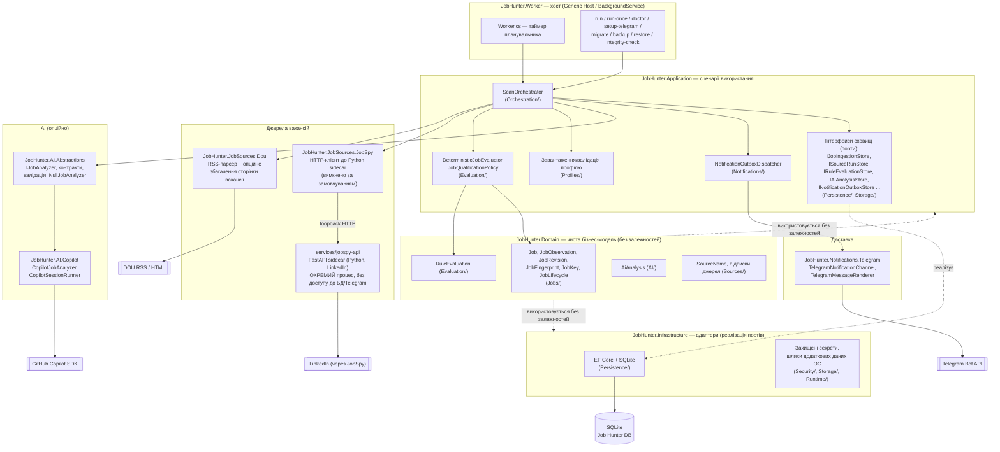
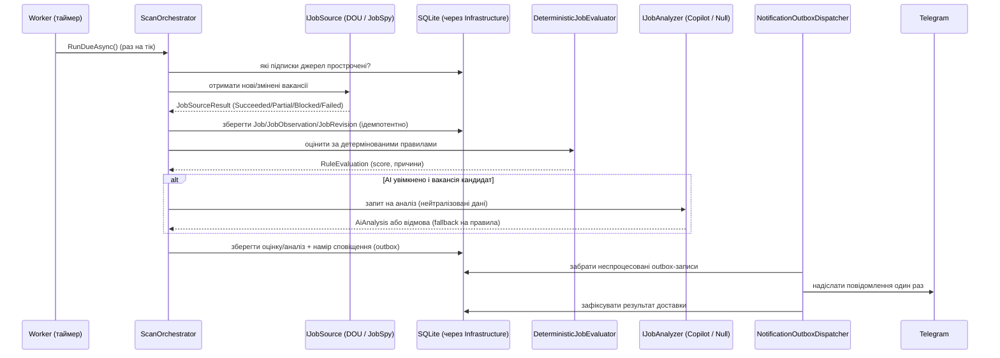
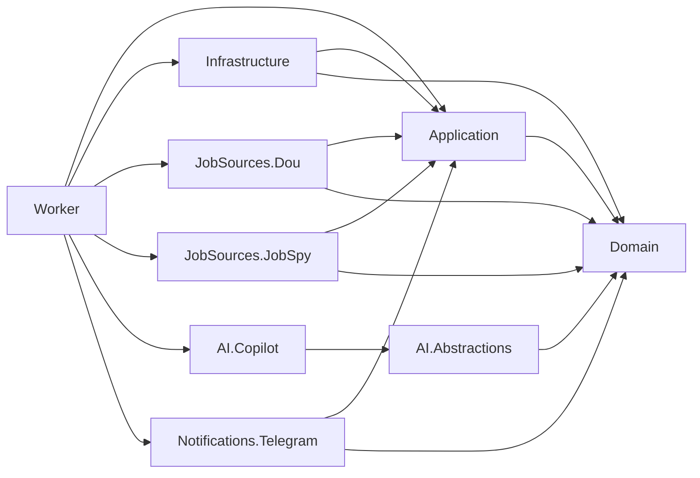

# Архітектура Job Hunter

> Огляд для швидкої орієнтації в коді. Джерело істини щодо вимог і рішень —
> [PRD.md](PRD.md), [IMPLEMENTATION_PLAN.md](IMPLEMENTATION_PLAN.md) та
> [DEPLOYMENT.md](DEPLOYMENT.md). Цей файл їх не замінює, а лише пояснює, де
> що лежить у коді.

## 1. Головна ідея

Job Hunter — це .NET Worker Service, який постійно (раз на кілька хвилин)
опитує джерела вакансій (DOU RSS, опційно LinkedIn через JobSpy), зберігає їх
у локальній SQLite, оцінює за детермінованими правилами (та опційно за
допомогою AI/Copilot) і надсилає відповідні вакансії в Telegram. AI та JobSpy
— опційні; ядро (DOU → правила → SQLite → Telegram) має працювати без них.

## 2. Діаграма шарів і проєктів

## 3. Потік одного циклу сканування

## 4. Основні компоненти та їхнє значення

### 4.1 `JobHunter.Worker` — хост процесу
- [`Worker.cs`](../src/JobHunter.Worker/Worker.cs) — `BackgroundService`, який
  за таймером викликає `ScanOrchestrator.RunDueAsync()`.
- [`WorkerCommand.cs`](../src/JobHunter.Worker/WorkerCommand.cs),
  `Program.cs` — розбір команд: `run`, `run-once`, `doctor`,
  `setup-telegram`, `migrate`, `backup`, `restore`, `integrity-check`.
- `*CompletionService.cs` (Migration, Doctor, RunOnce, TelegramSetup,
  DatabaseMaintenance, StartupInitialization) — одноразові операції, що
  виконуються при старті залежно від обраної команди.
- `RetentionWorker.cs` — фонове очищення застарілих даних (30 днів за
  замовчуванням).
- Це єдина точка входу застосунку; тут монтується DI-контейнер з усіх
  нижченаведених проєктів.

### 4.2 `JobHunter.Domain` — чиста модель
- Не залежить від EF Core, HTTP, Telegram, AI SDK — лише C#/BCL.
- `Jobs/` — агрегат `Job`, `JobObservation` (спостереження з джерела),
  `JobRevision` (зміна вмісту), `JobFingerprint`/`JobKey` (дедуплікація),
  `JobLifecycle` (new/possibly_stale/expired/removed), `CanonicalJobUrl`.
- `Evaluation/RuleEvaluation.cs` — результат детермінованої оцінки.
- `AI/AiAnalysis.cs` — результат AI-аналізу як доменна модель (без залежності
  від конкретного AI SDK).
- `Sources/` — `SourceName` та інші value-об'єкти джерел.
- `Profiles/`, `Operations/`, `Notifications/`, `Common/` — профіль
  кандидата, статуси операцій/запусків джерел, контракти сповіщень,
  спільні примітиви (наприклад, `IDateTimeProvider`).

### 4.3 `JobHunter.Application` — сценарії використання (use cases)
- `Orchestration/ScanOrchestrator.cs` — центральний координатор цикла:
  бере прострочені підписки джерел → викликає `IJobSource` → зберігає
  результати → оцінює → (опційно) аналізує AI → створює намір сповіщення
  (outbox). Залежить лише від інтерфейсів (портів), не від конкретних
  реалізацій EF/HTTP/Telegram/AI.
- `Sources/IJobSource.cs`, `JobSourceSubscriptions.cs` — контракт джерела
  вакансій і підписок на нього.
- `Evaluation/` — `DeterministicJobEvaluator` (версійована рубрика
  `rules-v1`), `JobQualificationPolicy` (пороги проходження),
  `JobAnalysisRequestFactory` (формує запит для AI), інтерфейси сховищ
  оцінок/AI-аналізу.
- `Notifications/NotificationOutboxDispatcher.cs` — читає durable outbox і
  надсилає через зареєстровані канали (Telegram), гарантуючи не більше
  одного надсилання на ключ.
- `Persistence/`, `Storage/` — інтерфейси сховищ (`IJobIngestionStore`,
  `ISourceRunStore`, `INotificationOutboxStore` тощо) — це "порти", які
  реалізує `JobHunter.Infrastructure`.
- `Profiles/`, `Security/`, `Runtime/` — завантаження/валідація профілю
  кандидата, редагування чутливих даних, обгортки часу/довкілля.

### 4.4 `JobHunter.Infrastructure` — адаптери інфраструктури
- `Persistence/` — EF Core + SQLite: реалізації сховищ з `Application`,
  міграції, унікальні індекси, WAL, короткі транзакції.
- `Security/` — доступ до захищених секретів (Telegram token, Copilot auth)
  через OS-специфічні механізми.
- `Storage/` — шляхи до даних застосунку (application data) на Windows/
  macOS/Linux.
- `Runtime/`, `Configuration/`, `DependencyInjection/` — реєстрація сервісів,
  прив'язка конфігурації, `TimeProvider`/lease-механізми запуску джерел.

### 4.5 Джерела вакансій
- `JobHunter.JobSources.Dou` — основне джерело: парсить DOU RSS
  (`DouJobSource.cs`, `Parsing/`), опційно збагачує описом зі сторінки
  вакансії (`DouDetailPageEnricher.cs`), надає підписки
  (`DouSourceSubscriptionProvider.cs`). Працює завжди, без Docker/Python.
- `JobHunter.JobSources.JobSpy` — .NET-клієнт до окремого Python sidecar
  (`JobSpyJobSource.cs`, `JobSpyStatusProbe.cs`). Вимкнено за замовчуванням,
  не має доступу до БД чи Telegram-креденшалів; при 403/429/challenge —
  зупиняє підписку і фіксує деградований стан, не намагаючись обійти захист.
- `services/jobspy-api` — окремий Python/FastAPI сервіс (може працювати в
  Docker або локальному venv), який реально ходить у LinkedIn через бібліотеку
  JobSpy й повертає `Succeeded/Partial/Blocked/Failed`.

### 4.6 AI-аналіз (опційний шар)
- `JobHunter.AI.Abstractions` — межа `IJobAnalyzer`, контракти запиту/відповіді,
  валідатор надсилання (`JobAnalysisSubmissionValidator.cs`),
  `NullJobAnalyzer.cs` — заглушка, коли AI вимкнено (система лишається
  повністю функціональною).
- `JobHunter.AI.Copilot` — перший (і поки єдиний) реальний адаптер:
  `CopilotJobAnalyzer.cs`, `CopilotSessionRunner.cs`,
  `CopilotAnalysisPromptBuilder.cs`. Типи GitHub Copilot SDK не проникають у
  `Domain`/`Application` — лише через реалізацію `IJobAnalyzer`.
- Вакансія, CV, метадані завжди трактуються як недовірені дані, а не як
  інструкції для AI.

### 4.7 Сповіщення
- `JobHunter.Notifications.Telegram` — `TelegramNotificationChannel.cs`
  (надсилання), `TelegramMessageRenderer.cs` (форматування, обмеження
  4096 символів), `TelegramSetupService.cs` (команда `setup-telegram`),
  `TelegramNotificationDestinationProvider.cs` (приватний чат-призначення).

### 4.8 Тести (`tests/`)
- `JobHunter.Domain.Tests`, `JobHunter.Application.Tests`,
  `JobHunter.Infrastructure.Tests` — модульні/інтеграційні тести на рівні
  шарів.
- `JobHunter.ContractTests` — контракти між .NET та JobSpy sidecar.
- `JobHunter.IntegrationTests` — наскрізні сценарії (fixtures, без живих
  джерел/Telegram).
- `Fixtures/` — записані RSS/HTML/JSON відповіді для детермінованих тестів.

## 5. Правила залежностей (напрямок стрілок має значення)

`Domain` не залежить ні від чого. `Application` залежить лише від `Domain`.
Усе, що знає про EF Core, HTTP, Telegram чи AI SDK, живе в `Infrastructure`,
джерелах, `AI.Copilot` чи `Notifications.Telegram` — і підключається до
`Application`/`Domain` тільки через інтерфейси. `JobHunter.Worker` — єдине
місце, що збирає всі конкретні реалізації разом (composition root).

## 6. Де шукати що

| Питання | Куди дивитись |
|---|---|
| Як розбирається RSS DOU? | [src/JobHunter.JobSources.Dou/Parsing/](../src/JobHunter.JobSources.Dou/Parsing) |
| Як рахується скор вакансії? | [src/JobHunter.Application/Evaluation/DeterministicJobEvaluator.cs](../src/JobHunter.Application/Evaluation/DeterministicJobEvaluator.cs) |
| Як формується запит до AI? | [src/JobHunter.Application/Evaluation/JobAnalysisRequestFactory.cs](../src/JobHunter.Application/Evaluation/JobAnalysisRequestFactory.cs) |
| Як відправляється Telegram-повідомлення? | [src/JobHunter.Notifications.Telegram/TelegramNotificationChannel.cs](../src/JobHunter.Notifications.Telegram/TelegramNotificationChannel.cs) |
| Де EF-міграції та схема БД? | [src/JobHunter.Infrastructure/Persistence/](../src/JobHunter.Infrastructure/Persistence) |
| Як влаштований цикл сканування? | [src/JobHunter.Application/Orchestration/ScanOrchestrator.cs](../src/JobHunter.Application/Orchestration/ScanOrchestrator.cs) |
| Де команди CLI (`run`, `doctor` тощо)? | [src/JobHunter.Worker/WorkerCommand.cs](../src/JobHunter.Worker/WorkerCommand.cs), [src/JobHunter.Worker/Program.cs](../src/JobHunter.Worker/Program.cs) |
| Що таке JobSpy і чому він окремо? | [services/jobspy-api/](../services/jobspy-api), [src/JobHunter.JobSources.JobSpy/](../src/JobHunter.JobSources.JobSpy) |
| Схема профілю кандидата | [schemas/candidate-profile.schema.json](../schemas/candidate-profile.schema.json), [deploy/examples/profile.yaml](../deploy/examples/profile.yaml) |
